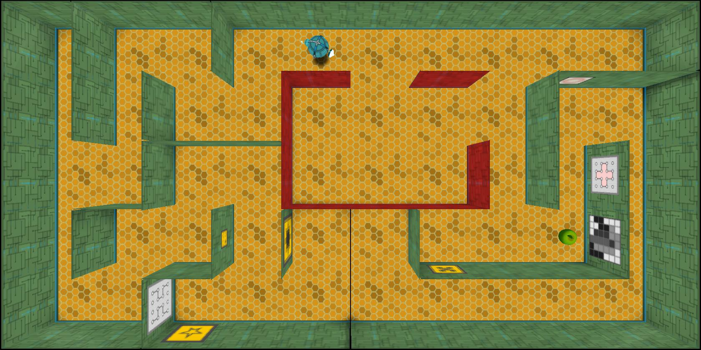

Game idea: top-down shooter

- We create level(s) with walls that resemble a maze
- Players/AI take turns to shoot at each other
    - Each turn, you have 10 seconds to move around, pick an angle to shoot at, and shoot
- Movement is slow
    - You can only move a short distance within the alloted time
- Environmental factors can make it harder to aim
    - e.g. wind: each turn there's wind blowing in a random direction
    - We can tell the player which way the wind is blowing and they have to compensate their shot
- Shooting
    - Pick an angle to shoot: we can display an arrow or something as the player is aiming
    - May need to figure out how to get bitblt to rotate textures? or maybe we can just use simple lines
    - Shots can destroy certain walls to open new paths, or can reflect off other walls

Features

- Four different graphical building blocks (textures, text, rects, lines)
- Sprites/animations
- Destructible terrain
- AI

Lots of this should be doable with our existing engine

- To implement turns, we can use something like the GameStage enum I created, really simple
    - One enum variant for each player's turn, update() checks whose turn it is and acts accordingly
